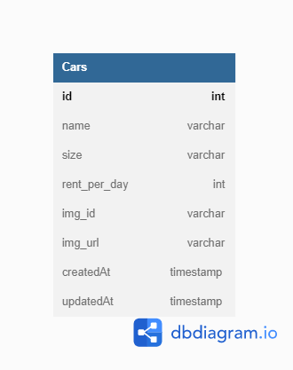

# BCR - Car Management Dashboard

Aplikasi web express.js untuk management data mobil dengan fungsi CRUD. Aplikasi dibuat sebagai bagian dari challenge chapter 4, fullstack web development course di Binar Academy. Aplikasi dibuat berdasarkan [desain dari figma](https://www.figma.com/file/H6xTtBW9Kzlf09nYnitvbH/BCR---Car-Management-Dashboard?type=design&node-id=18344-7128&mode=design).

# Frontend Server
## Setup Server

    cd frontend
    npm install
    
`npm install` diperlukan untuk menginstall semua dependencies yang diperlukan dalam project.  
Apabila diperlukan backend api settings dapat diubah di `frontend/public/config/api.js`

## Running Server

    cd frontend
    npm start

Server frontend secara default akan berjalan di `http://localhost:3000/`  
Port server bisa diganti di dalam file `frontend/server.js`  

## Server Routing
| Page | Route | Default Route |
|--|--|--|
| Homepage | `/` | http://localhost:3000/ |
| Add Car | `/add` | http://localhost:3000/add |
| Edit Car | `/edit?id={carId}` | http://localhost:3000/edit?id={carId} |
 
 

# Backend Server
## Setup Server

    cd backend
    npm install
    
`npm install` diperlukan untuk menginstall semua dependencies yang diperlukan dalam project.
    
Setelah itu pastikan [PostgreSQL](https://www.postgresql.org/download/) sudah ter-install dan berjalan di komputer. Kemudian setup file `backend/src/handler/db-handler/config/config.json` sesuai dengan settings database PostgreSQL yang sedang berjalan. Lanjut jalankan perintah berikut di terminal.

    cd backend/src/handler/db-handler
    sequelize db:create
    sequelize db:migrate
    
    // OPTIONAL: untuk menambahkan dummy data ke DB
    sequelize db:seed:all
    sequelize db:seed:undo // Untuk menghapus dummy data

Berikutnya setup aplikasi dengan akun [Cloudinary](https://cloudinary.com/) dilakukan dengan mengisi *api secrets* akun di file `backend/src/handler/cloudinary.js`

## Running Server

    cd backend
    npm start

Server frontend secara default akan berjalan di `http://localhost:4000/`  
Port server bisa diganti di dalam file `backend/app.js`   

## REST API Endpoints
### Hello World Test

Test untuk memastikan REST API telah berjalan dengan baik.

#### *HTTP Request*
> **GET**   
> `/api`

#### *Default Request URL*

    http://localhost:4000/api

#### *Expected Response*
Response Code: `200`  
Response Type: `application/json`  
Response Body:  

# Database Design

Database proyek ini hanya menggunakan satu tabel saja karena kompleksitas data yang dibutuhkan sangat simpel. Berikut diagram yang mempresentasikan model data yang digunakan dalam aplikasi ini:
  
 
